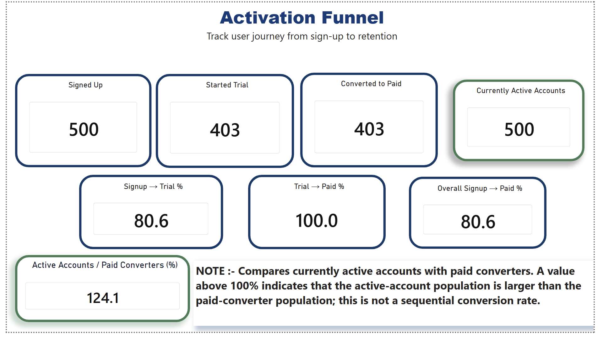
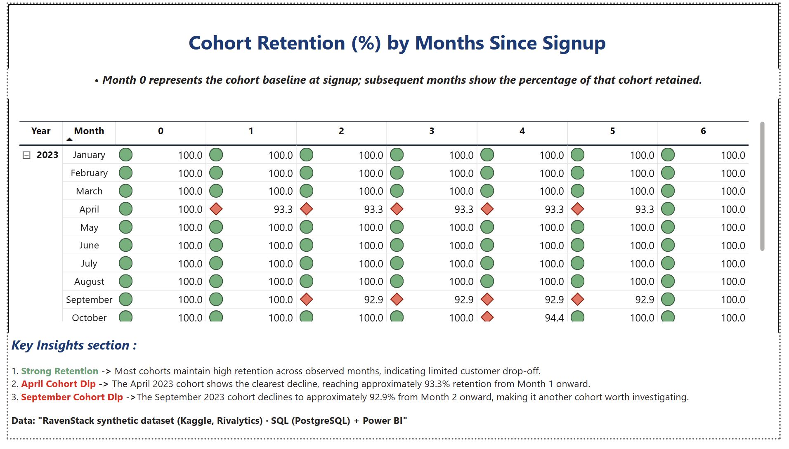

# SaaS Activation & Retention Analytics

An end-to-end SaaS analytics project analyzing customer activation, paid conversion, and cohort retention using PostgreSQL and Power BI.

## Project Overview

The objective of this project was to understand how users move through the SaaS customer lifecycle and whether customers remain active after becoming paid users.

The analysis focuses on two core business questions:

1. How effectively do users move from signup to trial and paid conversion?
2. How does customer retention change across signup cohorts over time?

The project uses the RavenStack synthetic dataset from Kaggle (Rivalytics).

## Analysis

The project covers:

- Activation funnel analysis
- Signup → trial conversion
- Trial → paid conversion
- Overall signup → paid conversion
- Active-account population analysis
- Cohort retention analysis
- SQL data validation and metric verification
- Identification of retention dips across cohorts

The **Active Accounts / Paid Converters (%)** metric compares the current active-account population with paid converters. It is not a sequential conversion rate.

## SQL Analysis

The SQL layer contains queries for:

- Data validation
- Activation funnel construction
- Cohort creation
- Month-level retention calculation
- Retained-account counts
- Retention percentages

CTEs and date-based cohort logic are used to keep the analytical steps explicit and reproducible.

## Dashboard

### Activation Funnel

The funnel tracks the customer journey from signup through trial and paid conversion, with supporting conversion metrics.

### Cohort Retention

The cohort view tracks retention by months since signup and highlights cohorts with meaningful retention declines.

## Project Outcome

This project demonstrates an end-to-end analytics workflow:

**Raw relational data → SQL validation → Business metric definition → Funnel analysis → Cohort analysis → Power BI visualization → Business insights**

The project focuses on analytical correctness as well as communicating results in a stakeholder-readable format.
